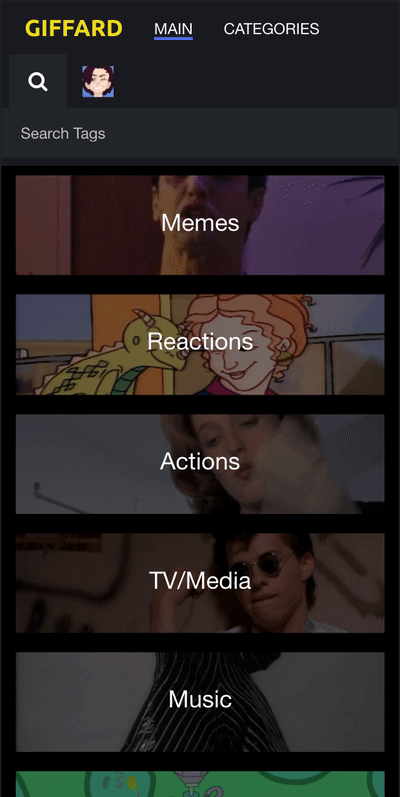

# Giffard

> Animated GIF sharing platform.

A platform to share, tag, edit and find animated GIFs. Includes a Nodejs server and React client. Deployed with Heroku, Mongodb Atlas, and Backblaze B2. [Demo](https://giffard.top)

<p align="center">
  
</p>

## Technology Stack

- Server: Node, Express, MongoDB
- Client: React(Functional/Hooks)
- Authentication: bcrypt, jsonwebtoken
- Testing: Jest
- Demo Deployment:
  - Front/Back: Heroku
  - Database: Mongo Atlas
  - S3 Storage: Backblaze B2
  - CDN: Cloudflaire

## Development

Required dependencies: Node 16, NPM 7

Clone the respritory `git clone https://github.com/AVanVlack/Giffard.git` then `cd Giffard`.

Install with `npm install`

Setup varibles for the database and object storage in `server/.env`

Start developement server with `npm run dev-server`. Or Start the front and back in seperate terminals `cd server && nodemon server.js` and ` cd client && npm start`

Then in a separate terminal, start developement client with `npm dev-client`.

## Deploying

### Heroku

This repo is ready to be deploy to directly to Heroku. Use any Mongodb Database and S3 compatible storage. Deploy this repo directly to a dyno. NPM workstations will build the client and the server will handle the built statics.

## To-Do

```
- [ ] Pages of list of gifs
- [ ] Validation
- [ ] Testing
```

## Release History

- 0.2.1
  - Changed from gm to direct binary due to dependency complications.
- 0.2.0
  - Full rebuilt with updated libraries and React frontend.
- 0.1.0
  - Initial app in node/angular.

## Meta

Drew VanVlack – [@avanvlack](https://twitter.com/avanvlack) – A.Vanvlack@Gmail.com
Distributed under the MIT license. See `LICENSE` for more information.

[https://github.com/avanvlack](https://github.com/avanvlack/)

## Contributing

1. Fork it (<https://github.com/avanvlack/Giffard/fork>)
2. Create your feature branch (`git checkout -b feature/fooBar`)
3. Commit your changes (`git commit -am 'Add some fooBar'`)
4. Push to the branch (`git push origin feature/fooBar`)
5. Create a new Pull Request
